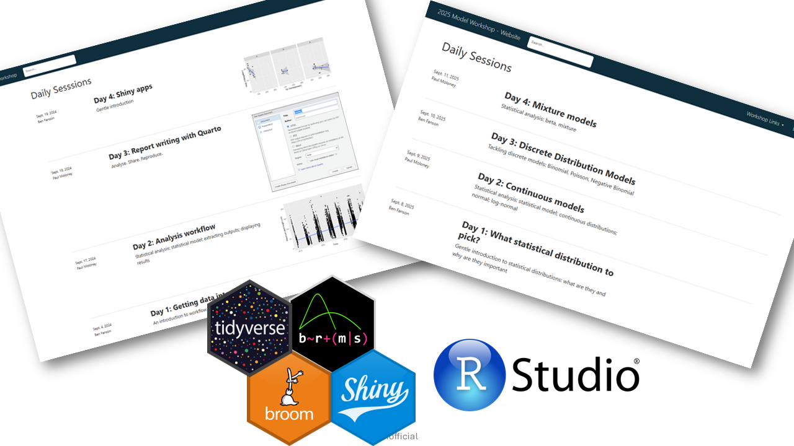
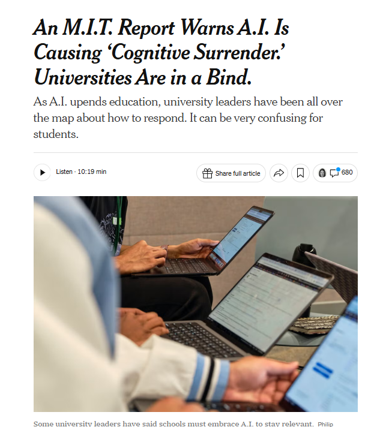
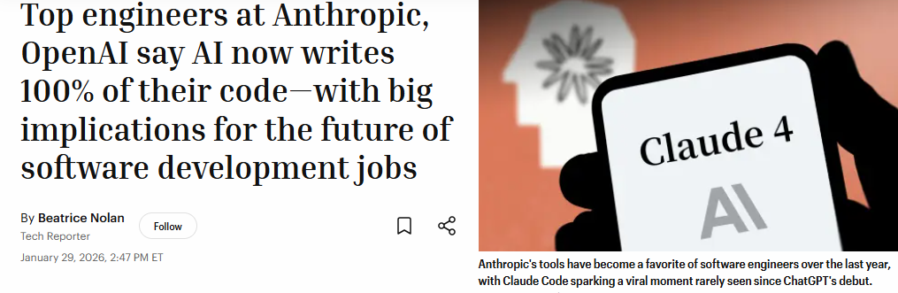
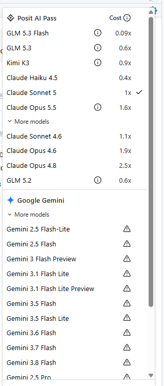

----------

# Housekeeping

- [Workshop website](https://bfanson.github.io/2026_Workshops/)     https://bfanson.github.io/2026_Workshops/


----------

# Agenda

1) Set the stage/background so on similar footing
2) Use an example to solidify some of the ideas
3) <span style="font-color=red;">Morning Tea 😁<span>
4) Discussion of topics


::: {.callout-note}

This is more of guided-group conversation than "lecture"...feel free to interpret at any point if you have a question, if you want to test an idea, if we said something wrong

:::


----------

# Confession upfront

## Confused as what is needed in workshops now


 

<br>


We talked about fun stuff like...😁


$$
\begin{align}
\text{Observation}\\
\text{td}_i &\sim \text{HLN}(\pi, \mu_i, \sigma^2) \\
Y &= Y \times Z \\
X &\sim \text{LN}(\mu_i, \sigma^2) \\
Z &\sim Bern(\pi) \\

\text{Process}\\
\mu_i &= \text{time}_i \times \text{exclusion}_i


\end{align}
$$

and...

$$
\begin{align}
\text{Observation}\\
y_i &\sim \text{ZINB}(\pi, \mu_i, \rho) \\
\text{Process}\\
log(\mu_i) &= \alpha + \beta x_i\\
logit(\pi) &= \beta_0
\end{align}
$$

<br>


## Teaching is confused


[{width=50%}](https://www.nytimes.com/2026/09/15/us/universities-ai-warnings-enthusiasm.html)


<br>


## Some of best coders in the world are not coding anymore

::: {.callout-note}
## Some reasons

- Trained on billions of line of code
- Clean coding...writes very disciplined code
- Ridiculously fast
- Reads warnings and errors outputs😉

:::


[{width=50%}](https://fortune.com/2026/01/29/100-percent-of-code-at-anthropic-and-openai-is-now-ai-written-boris-cherny-roon/)


<aside> Note that this was back in <span 
style="color:steelblue;font-size:110%;font-weight:bold;">January 29 2026<span> </aside>


<br>


----------

# LLMs...a few comments

-  LLMs (by themselves) can be surprisingly bad


::: {.callout-note}
__Main Point:__ Be careful about judging LLMs solely on its "stupidish" moments.   Often if you give it the right tools and context, it will succeed.

:::


----------

# Agents

```{mermaid}
%%| label: fig-agent
%%| fig-cap: Thinking about AI and LLMs []

flowchart LR

    AI[["AI"]]

    AI --> ML["Machine learning<br> (NNs, CNNs, Boosted)"]
    AI --> LLM["LLMs"]
    LLM --> bot["Hyped-up search engine"]
    LLM --> agent["Autonomous(-ish) Agent"]

```


```{mermaid}
%%| label: fig-uses
%%| fig-cap: Components of Agents

graph LR

 H("👤 Human") --> AI[["Agent/Harness"]]

 AI --> LLM["LLM: the brain (or IT)"]
 AI --> TS["Tools"  ]
 AI --> SK["Skills" ]
 AI --> CT["Context"]

```

## Harnesss

Software that "manages" the LLM, the skills, tools, grabbing context.  But, also come in their own flavour and own set of tools, skills, etc.  Thus, the software can identify LLMs weaknesses and mitigate/augment 

Example such as...

| Tool | Is it a harness? | Is it an agent? | Better description |
|:--|:--:|:--:|:--|
| [Posit Assistant / Posit AI](https://posit.co/products/ai) | ✅ Yes | ✅ Yes | A data science agent built on a data-science-specific harness |
| [Claude Code](https://claude.com/product/claude-code) | ✅ Yes | ✅ Yes | A coding agent with its own harness |
| [Codex](https://openai.com › codex) | ✅ Yes | ✅ Yes | A coding agent powered by the Codex harness |
| [Gemini CLI / Gemini Code Assist](https://geminicli.com/) | ✅ Yes | ✅ Yes | A coding and general-purpose agent built on Google's Gemini harness |

<aside> Note on naming - Posit AI is the original name and was switched to Posit Assistant.  They are the same thing </aside>


## LLMs...aka the "brain"

__Note - Reminder that this is trained instanced upto the end date of the training__




## Tools

Allows it to "touch" your computer...

| Tool Category | Example Tool | Purpose | Example Agent Action |
|:--|:--|:--|:--|
| File System | Read File | Read file contents | Examine a Quarto document before editing
| File System | Write File | Create new files | Generate a new R script |
| File System | Edit File | Modify existing files | Update a function in a package |
| File System | List Files | Explore directories | Discover project structure |
| Search | Grep / Search | Find text patterns | Locate all references to a function |
| Terminal | Bash Shell | Execute commands | Run `R CMD check` |
| Terminal | Git | Version control | Create a commit after modifications |
| Programming | R Runtime | Execute R code | Fit a GAM model |


<aside> - If an agent can run R code, then all the packages/API etc in R become available.  Ditto for python.</aside>


## Skills

Higher level, more like specialised agents: biometrician, spatial analyst, report writer, shiny app creator

| Skill | Example Task |
|:--|:--|
| [Statistician](https://github.com/bfanson/2026_Workshops/blob/main/skill-staging/statistician/SKILL.md) | Fit and compare GAM, GLMM, and HMM models for fish movement data, evaluate assumptions, and identify the best-supported model using AIC. |
| Spatial Analyst | Create movement maps from acoustic telemetry data, calculate home ranges, and analyse river network connectivity using sf, terra, and sfnetworks. |
| [Report Writer](https://github.com/bfanson/2026_Workshops/blob/main/skill-staging/quarto/SKILL.md) | Generate a Quarto report that summarizes study objectives, methods, results, figures, and key findings for stakeholders. |
| Shiny App Creator | Build an interactive dashboard that allows users to explore telemetry detections, filter by species and date, and visualize movement patterns on a map. |


<aside> Posit AI comes with its own built-in skills.  Mine are located at C:\Users\{username}\AppData\Local\RStudio\pai\bin\dist\skills.  You can just ask Posit AI to find them</aside>

## Memory/Context

Set the stage of the Agent.


| AGENTS.md Objective | Description |
|---|---|
| Project Context | Describes the purpose of the project, project structure, data sources, key datasets, analytical units, domain knowledge, assumptions, preferred packages, reporting requirements, and links to supporting documentation. |
| Workflow Rules | Defines the preferred way work is performed, including coding standards, analysis workflow, package-development practices, reporting conventions, file organisation, reproducibility requirements, testing expectations, and references to `STYLE.md`. |
| Constraints | Specifies mandatory requirements and guardrails such as preserving raw data, maintaining backwards compatibility, using approved coordinate reference systems, handling sensitive data securely, avoiding destructive file operations, respecting database constraints, and documenting assumptions and limitations. |


---------------

# Iteration efficiency

```{mermaid}
%%| label: fig-agent
%%| fig-cap: Iteration

graph LR

    H("👤 Human")
    AI[["Coding<br> agent"]]
    
    H --> AI
    AI --> H
    AI --> W['write code']
    W --> R['run code']
    R --> E['find errors']
    E --> W

```


# Costs

<span style="background:yellow;">Not trivial<span>

Just need to play around to get a feel for how you work.  
- Models differ greatly with respect to cost.  

- How often you initiate a new chat can greatly affect it

A few examples

| Task | Cost |
|---------------------------------------|-----:|
| Create a plot of x and y              | ~$0.01  |
| Plan out a statistical analysis plan  | $0.5-$1.00  |
| Run a full analysis for a simple dataset, 
including all R scripts and report document (for the example below)  | ~$5.00  |


----------

# Example with soil crust 

[Link to dataset](https://bfanson.github.io/2025_Models_workshop/sessions/day4-mixed/)


## Copilot approach

[Copilot chat](Copilot basic.html)

[Analysis report](second effort updated.html)


## Agent approach

::: {.callout-note}
## Advantages

- Copy/paste tedious
- Gives context from your R project
- Iterates on itsself...testing the code it writes
- Fits a natural workflow

:::

[Posit AI chat](conversation-export.html)

[Agent report](agent_report.html)

----------


# Paradigm shift

## How are humans fitting in the data science/analyst role


```{mermaid}
%%| label: fig-paradigm
%%| fig-cap: Thinking about role in workflow

graph LR

    H("👤 Human")

    H <--> DB[["Database Agent"]]
    H <--> STATS[["📊 Statistics Agent"]]
    H <--> GIS[["🗺 GIS Agent"]]
    H <--> WRITER[["📝 Writer Agent"]]
    H <--> APP[["Shiny App Agent"]]

 
```


----------

# How are you using agents?

```{mermaid}
%%| label: fig-uses
%%| fig-cap: how AI (agents) being used?

graph LR

    AI[["LLM"]]

    AI --> WF["Workflow"]
    AI --> TH["Ideas"]

    WF --> Pkg["R Packages"]
    WF --> Db["Database"]
    WF --> QC["QC tester"]
    WF --> QC["Documentation"]

    TH --> PI["Project development"]
    TH --> SAP["Analysis planning"]
    TH --> PR["Communicating"]

```


----------

# Discussion topics

- How are we going to get trained on it? Not fall behind behind consultants/academy/etc 

- Are we heading to a standardised workflow? E.g. suite of skills MD files? 

- Ensure that it is an active learning/developing process? Preclude "intellectual laziness"?

- Are we developing ARI-wide agents?  Are we sharing standard skill sets for specific agents?

- allowing us to do things we should have been doing the whole time in ideal world😔... [documentation, additional QC test, exploring alternative models]


----------

# Vibe-coding module: what would be useful???


