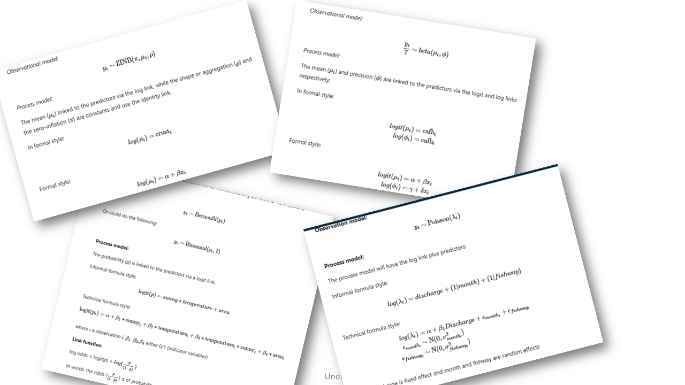

----------

# Housekeeping

- [Workshop website](https://bfanson.github.io/2026_Workshops/)     https://bfanson.github.io/2026_Workshops/


----------

# Agenda

1) Set the stage/background
2) Use an example to solidify some of the ideas
3) <span style="font-color=red;">Morning Tea 😁<span>
4) Discussion of topics


----------

# Confession upfront

## Confused as what is needed in workshops now


 

<br>


_Plus side, you get to avoid these..._



<br>


### Teaching as confused


 


<br>


### Best coders in the world are not coding anymore.


{width=50%}

<br>

Note that this was <span 
style="color:steelblue;font-size:110%;font-weight:bold;">January 29 2026<span>

<br>

----------

# Paradigm shift

## How are humans fitting in the data science/analyst role


```{mermaid}
%%| label: fig-paradigm
%%| fig-cap: Thinking about role in workflow

graph LR

    H("👤 Human")

    H <--> DB[["Database Agent"]]
    H <--> STATS[["📊 Statistics Agent"]]
    H <--> GIS[["🗺 GIS Agent"]]
    H <--> WRITER[["📝 Writer Agent"]]

 
```

<aside> Aside feature... adding as a holder for now </aside>


----------

# Agents

```{mermaid}
%%| label: fig-agent
%%| fig-cap: Thinking about AI and LLMs []

flowchart LR

    AI[["AI"]]

    AI --> ML["Machine learning<br> (NNs, CNNs, Boosted)"]
    AI --> LLM["LLMs"]
    LLM --> bot["Hyped-up search engine"]
    LLM --> agent["Autonomous Agent"]

```


```{mermaid}
%%| label: fig-uses
%%| fig-cap: Components of Agents

graph LR

 H("👤 Human") --> AI[["Agent/Harness"]]

 AI --> LLM["LLM: the brain (or IT)"]
 AI --> TS["Tools"  ]
 AI --> SK["Skills" ]
 AI --> CT["Context"]

```

## Harnesss

Software that "manages" the LLM, the skills, tools, grabbing context.  But, also come in their own flavour and own set of tools, skills, etc.  Thus, the software can identify LLMs weaknesses and mitigate/augment 

Example such as...

| Tool | Is it a harness? | Is it an agent? | Better description |
|:--|:--:|:--:|:--|
| Posit Assistant / Posit AI | ✅ Yes | ✅ Yes | A data science agent built on a data-science-specific harness |
| Claude Code | ✅ Yes | ✅ Yes | A coding agent with its own harness |
| Codex | ✅ Yes | ✅ Yes | A coding agent powered by the Codex harness |
| Gemini CLI / Gemini Code Assist | ✅ Yes | ✅ Yes | A coding and general-purpose agent built on Google's Gemini harness |


## LLMs


## Tools

Allows it to "touch" your computer...

| Tool Category | Example Tool | Purpose | Example Agent Action |
|:--|:--|:--|:--|
| File System | Read File | Read file contents | Examine a Quarto document before editing
| File System | Write File | Create new files | Generate a new R script |
| File System | Edit File | Modify existing files | Update a function in a package |
| File System | List Files | Explore directories | Discover project structure |
| Search | Grep / Search | Find text patterns | Locate all references to a function |
| Terminal | Bash Shell | Execute commands | Run `R CMD check` |
| Terminal | Git | Version control | Create a commit after modifications |
| Programming | R Runtime | Execute R code | Fit a GAM model |


__Note - If an agent can run R code, then all the packages/API etc in R become available.  Ditto for python.__


## Skills

Higher level, more like specialised agents: biometrician, spatial analyst, report writer, shiny app creator

| Skill | Example Task |
|:--|:--|
| Statistician | Fit and compare GAM, GLMM, and HMM models for fish movement data, evaluate assumptions, and identify the best-supported model using AIC. |
| Spatial Analyst | Create movement maps from acoustic telemetry data, calculate home ranges, and analyse river network connectivity using sf, terra, and sfnetworks. |
| Report Writer | Generate a Quarto report that summarizes study objectives, methods, results, figures, and key findings for stakeholders. |
| Shiny App Creator | Build an interactive dashboard that allows users to explore telemetry detections, filter by species and date, and visualize movement patterns on a map. |


## Iteration efficiency


```{mermaid}
%%| label: fig-agent
%%| fig-cap: Iteration

graph LR

    H("👤 Human")
    AI[["Coding<br> agent"]]
    
    H --> AI
    AI --> H
    AI --> W['write code']
    W --> R['run code']
    R --> E['find errors']
    E --> AI

```


## Costs

<span style="background:yellow;">Not trivial<span>

Have to play around to get a feel for.  Models differ greatly with respect to cost.


----------

# Example with soil crust 

[Link to dataset](https://bfanson.github.io/2025_Models_workshop/sessions/day4-mixed/)


## Copilot approach

[Copilot chat](Copilot basic.html)

[Analysis report](second effort updated.html)


## Agent approach


----------

# How are you using agents?

1) workflow efficiency


2) 

```{mermaid}
%%| label: fig-uses
%%| fig-cap: Thinking about Agent roles

graph LR

    AI[["LLM"]]

    AI --> WF["Workflow"]
    AI --> TH["Sounding board"]

    WF --> Pkg["R Packages"]
    WF --> Db["Database"]
    WF --> QC["QC tester"]

    TH --> PI["Project creation"]
    TH --> SAP["Analysis idea"]
    TH --> PR["Communicating"]

```


----------

# Topics

- How are we going to get trained on it? Not fall behind behind every else


- Are we heading to a standardised workflow? 


- Ensure that it is an active learning/developing process? preclude Intellectual laziness?

- Are we developing ARI-wide agents?  Are we sharing standard skill sets for specific agents?

- 


----------

# Vibe-coding module: what would be useful???

Here again, we are showing our confusion on how to proceed.


